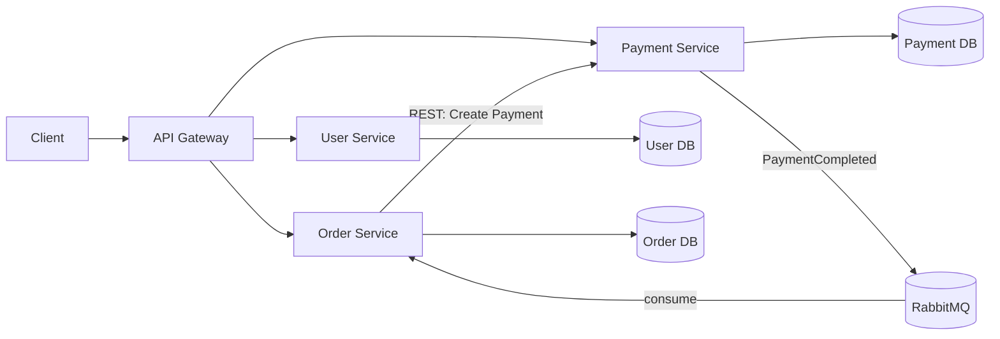

# Architecture Design

## Overview

This system uses service-based architecture:

- Independent services and deployment
- Database per service
- Hybrid communication: REST + event-driven messaging
- Layered design in each service: routes -> controllers -> services -> repositories

## Diagram



## Service responsibilities

### User Service

- Register, login, user profile
- Owns user identity data

### Order Service

- Create and query order
- Manage order state (`PENDING`, `PAID`)
- Subscribes payment completed events

### Payment Service

- Process payment
- Store payment transactions
- Publish `PaymentCompleted`

## Event message example

```json
{
  "eventType": "PaymentCompleted",
  "occurredAt": "2026-03-25T11:00:00.000Z",
  "data": {
    "orderId": 1001,
    "paymentId": 2001,
    "userId": 1,
    "amount": 120000,
    "transactionRef": "MOCK_TXN_1001_1711360000000"
  }
}
```

## Sync vs Async

### Sync (REST)

- Good for immediate response
- Simpler but tighter coupling

### Async (Broker)

- Better decoupling and resilience
- Eventual consistency and more operational complexity

## Failure handling

- REST timeout and retry with exponential backoff
- Queue durability and persistent messages
- Consumer retry and DLQ pattern (recommended extension)
- Idempotency key for payment creation (recommended extension)
