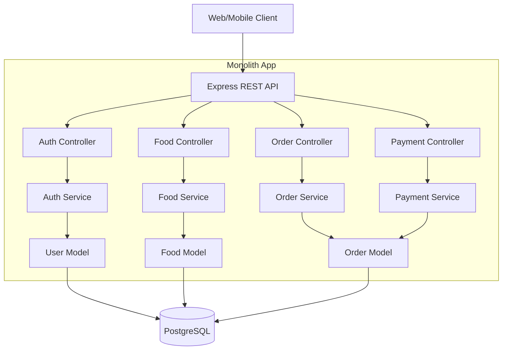

# Food Ordering Monolith

A monolithic online food ordering system with Node.js, Express, REST API, and PostgreSQL.

## 1) Architecture explanation

This project is **monolithic**:

- One codebase
- One deployable app
- One database

Modules are separated by layers inside the same app:

- `models`: DB access
- `services`: business logic
- `controllers`: request-response handling
- `routes`: endpoint mapping
- `middlewares`: auth, validation, error handling

## 2) Simple architecture diagram



## 3) Folder structure

```text
food-ordering-monolith/
  sql/
    schema.sql
  src/
    config/
      db.js
    controllers/
      auth.controller.js
      user.controller.js
      food.controller.js
      order.controller.js
      payment.controller.js
    middlewares/
      auth.middleware.js
      error.middleware.js
      validate.middleware.js
    models/
      user.model.js
      food.model.js
      order.model.js
    routes/
      auth.routes.js
      user.routes.js
      food.routes.js
      order.routes.js
      payment.routes.js
      index.js
    services/
      auth.service.js
      user.service.js
      food.service.js
      order.service.js
      payment.service.js
    utils/
      jwt.js
    validators/
      auth.validator.js
      order.validator.js
      payment.validator.js
    app.js
    server.js
  .env.example
  package.json
```

## 4) Database

Single PostgreSQL database with 3 main tables:

- `users`
- `foods`
- `orders`

Schema file: `sql/schema.sql`

## 5) Setup

1. Create database `food_ordering` in PostgreSQL.
2. Run schema:

```bash
psql -U postgres -d food_ordering -f sql/schema.sql
```

3. Install packages:

```bash
npm install
```

4. Create `.env` from `.env.example` and set values.
5. Run app:

```bash
npm run dev
```

## 5.1) Run with Docker

Run monolith app and PostgreSQL by Docker Compose:

```bash
docker compose up --build -d
```

Stop services:

```bash
docker compose down
```

Main API:

- `http://localhost:4000/health`

## 6) API endpoint list

### Auth

- `POST /api/auth/register`
- `POST /api/auth/login`

### User

- `GET /api/users/me` (Bearer token required)

### Food Ordering

- `GET /api/foods`
- `POST /api/orders` (Bearer token required)
- `GET /api/orders` (Bearer token required)

### Payment (mock)

- `POST /api/payments/:orderId/pay` (Bearer token required)

## 7) Example API request/response

### 7.1 Register

Request:

```http
POST /api/auth/register
Content-Type: application/json

{
  "fullName": "Nguyen Van A",
  "email": "a@example.com",
  "password": "123456"
}
```

Response:

```json
{
  "user": {
    "id": 1,
    "full_name": "Nguyen Van A",
    "email": "a@example.com",
    "created_at": "2026-03-25T10:00:00.000Z"
  },
  "token": "<jwt_token>"
}
```

### 7.2 Login

Request:

```http
POST /api/auth/login
Content-Type: application/json

{
  "email": "a@example.com",
  "password": "123456"
}
```

Response:

```json
{
  "user": {
    "id": 1,
    "full_name": "Nguyen Van A",
    "email": "a@example.com",
    "created_at": "2026-03-25T10:00:00.000Z"
  },
  "token": "<jwt_token>"
}
```

### 7.3 Get food list

Request:

```http
GET /api/foods
```

Response:

```json
[
  {
    "id": 1,
    "name": "Pho Bo",
    "description": "Vietnamese beef noodle soup",
    "price": "45000.00",
    "is_available": true
  }
]
```

### 7.4 Create order

Request:

```http
POST /api/orders
Authorization: Bearer <jwt_token>
Content-Type: application/json

{
  "items": [
    { "foodId": 1, "quantity": 2 },
    { "foodId": 2, "quantity": 1 }
  ]
}
```

Response:

```json
{
  "id": 10,
  "user_id": 1,
  "items": [
    {
      "foodId": 1,
      "foodName": "Pho Bo",
      "quantity": 2,
      "unitPrice": 45000,
      "lineTotal": 90000
    }
  ],
  "total_amount": "115000.00",
  "status": "PENDING",
  "created_at": "2026-03-25T10:10:00.000Z",
  "paid_at": null
}
```

### 7.5 Pay order (mock payment)

Request:

```http
POST /api/payments/10/pay
Authorization: Bearer <jwt_token>
```

Response:

```json
{
  "payment": {
    "transactionId": "MOCK_TXN_10_1711360000000",
    "status": "SUCCESS",
    "amount": 115000
  },
  "order": {
    "id": 10,
    "user_id": 1,
    "items": [],
    "total_amount": "115000.00",
    "status": "PAID",
    "created_at": "2026-03-25T10:10:00.000Z",
    "paid_at": "2026-03-25T10:20:00.000Z"
  }
}
```

## 8) Validation included

- Register/Login input validation with Zod
- Create order payload validation
- Payment route param validation
- Error response standardization

## 9) Core status flow

`Order Status: PENDING -> PAID`
